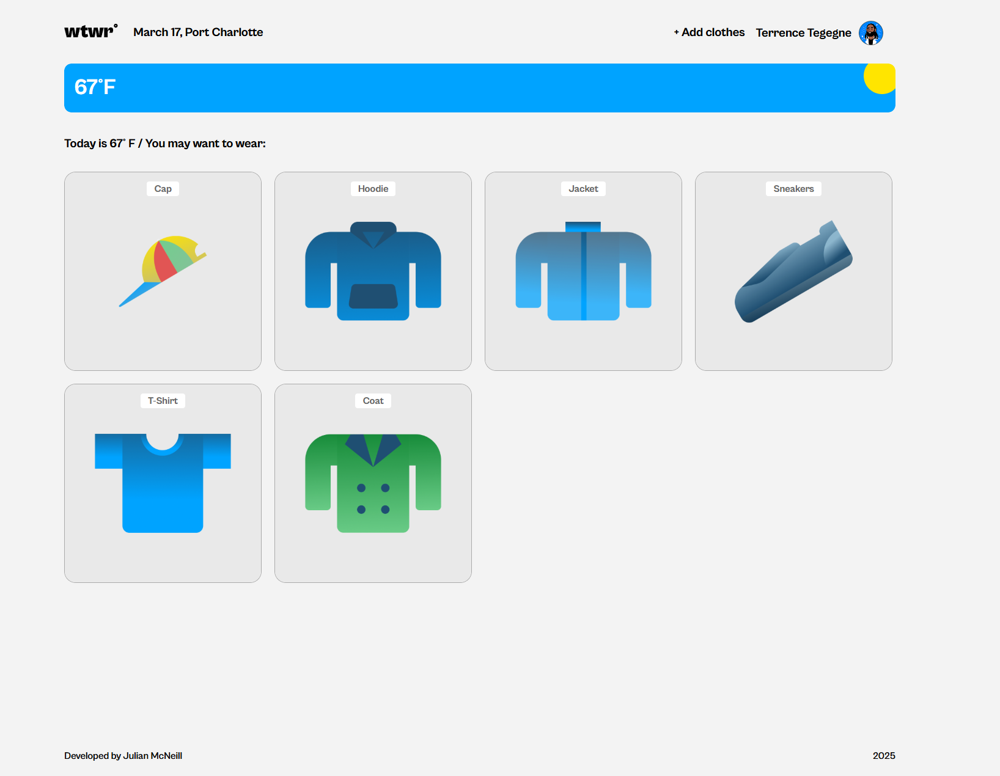

# WTWR

A React app giving users suggestions on what to wear based on the weather.

## Description

**WTWR** (What To Wear) is a simple React app with the goal of giving users suggestions on what to wear, given the current weather at their location. Users will be able to upload clothing items they own to their personal profile, the app will ask for their location, and will make suggestions based on what the user currently owns and their local weather forecast. A Randomize feature will also be implemented, giving users a variety of different options to consider for any given forecast.

## Tech Stack

- HTML/CSS
- JavaScript
- Figma
- Responsive Design (this app will look and perform just as well on most screen sizes)
- React.js (used to manage state and update the page based on user inputs)
- OpenWeather API (used to get up to date weather forecasts for users based on their location)
  - For more info: [OpenWeather](https://openweathermap.org/)

## Images

## Devlog
Coming Soon...

## Link

[WTWR on GitHub Pages](https://julesdowork.github.io/se_project_react)
